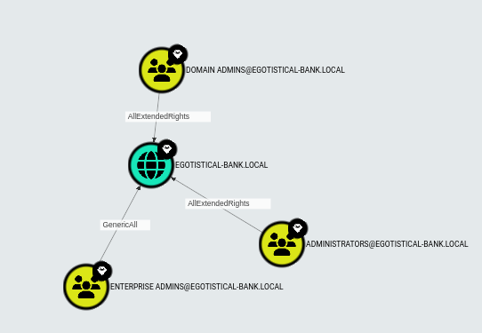
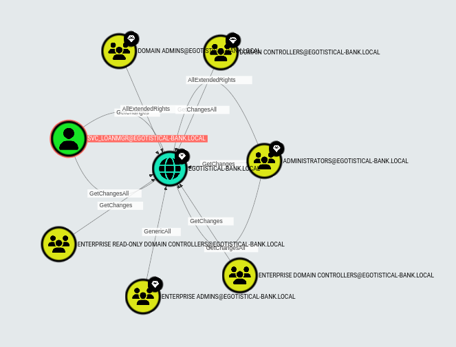
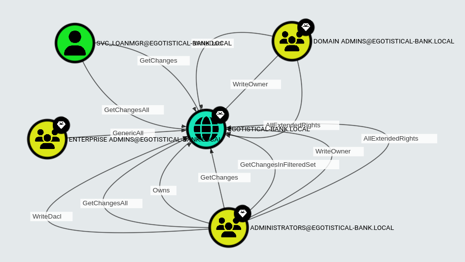

### DCSync Custom Query

The generic inbuilt query for DCSync in Bloodhound Community is

```cypher
MATCH p=()-[:DCSync|AllExtendedRights|GenericAll]->(:Domain)
RETURN p
```


The above query do not return the other possible paths to carry out DCSync. For example it do not include edges with GetChanges and GetChangesAll permissions.
As obtained from BloodHound documentation, DS-Replication-Get-Changes-All permission in conjunction with DS-Replication-Get-Changes, a principal may perform a DCSync attack.

We can modify the query a little bit to obtain those missing paths.

```cypher
MATCH p=()-[:DCSync|AllExtendedRights|GenericAll|GetChanges|GetChangesAll]->(:Domain)
RETURN p
```


Now we have more paths. However this returns few more additional nodes which has atleast one of the edge permission of ```GetChanges``` or ```GetChangesAll```.
This does not qualify the condition to perfrom DCSync as both the permissions must be present.

We can narrow it down even further, to obtain the expected paths by omiting the single edge permission of ```GetChanges``` or ```GetChangesAll```

```cypher
MATCH (b)-[:GetChangesAll]->(:Domain)
WITH b MATCH (b)-[:GetChanges]->(:Domain)
MATCH (p)-[:DCSync|AllExtendedRights|GenericAll]->(:Domain)
MATCH y=(b)-[]->(:Domain)<-[]-(p)
RETURN y
```

