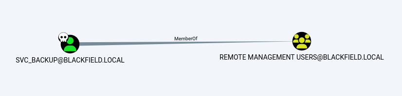

# Remote Management Users

A user which is part of the ```Remote Management Users``` group has the privilege to can access machines over WinRM.

``` cypher
MATCH p=(n)-[b:MemberOf]->(c:Group {samaccountname : "Remote Management Users"}) RETURN p
```

If we have an owned principal which is a part of the ```Remote Management Users``` we can get access to the machine. 


